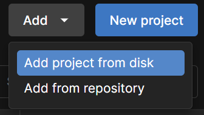
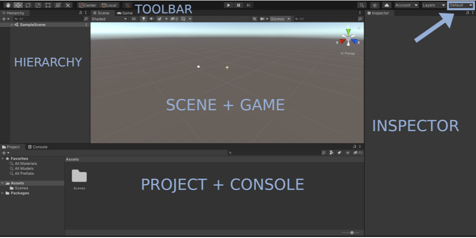

# MansionEscape

**MansionEscape** is a first-person, exploratory puzzle game set in a haunted mansion where the player must navigate through each room in the mansion, solve puzzles, collect items, and find the hidden exit to escape each room.

## Table of Contents

- [Game Concept](#game-concept)
- [Features (For Developers)](#features)
- [How to Play (For Players)](#how-to-play)
- [Requirements (For Developers)](#requirements)
- [Setup Instructions (For Developers)](#setup-instructions)


## Game Concept

### Puzzle Game

**Genre:**

- Adventure
- Narrative
- Puzzle
- Survival Horror

**Characteristics:**

- Exploration
- Control
- Choices
- Experimentation
- Problem-solving

**Central Gameplay Features**

- Collectibles and inventory systems
- Puzzles
- Narrative

## Features 

### Player Mechanics

**1. Movement:**

- Implement player movement (Arrow Keys or WASD)
- Confine player to room.
- Implement basic movement animation.

**2. Interaction:**

- Player can interact with objects in the scene (desks, paintings, etc.)
- Player receives a description of the interactive objects when near them.
- Player can pick up objects.

**3. Inventory:**

- Basic inventory system to collect and store objects in the room.
- Display of the inventory system.
- Player can inspect items in the inventory (brief description).

**4. Puzzle Solving:**

- Player can collect key items from within the room (keys, puzzle pieces, notes etc.)
- Objects interact with other objects ( a player can pick up a key from the draw of a desk).
- Clear feedback on if a puzzle is successful or not.
- Puzzles could be riddles.

### Environment

The player navigates through a series of distinct rooms that collectively form a mysterious and haunting mansion. Each room features unique characteristics and challenges:

**1. Room Types:**

The mansion consists of various room types, each with its own theme and purpose:

- Bathroom
- Bedroom
- Kitchen
- Living Room
- Dining Room
- Library
- Basement

**2. Room Design:** Each room is enclosed within four walls, providing a sense of confinement while allowing players to view their surroundings freely.

**3. Hidden Exits:**

Each room contains an exit that may be concealed or challenging to access, adding to the game’s exploratory and puzzle-solving elements.

**4. Interactable Objects:**

Players can interact with a variety of objects scattered throughout the rooms, including:

- Furniture (tables, chairs, etc.)
- Storage units (drawers, cupboards, chests)
- Decorative items (pictures, lamps, etc.)
- Locked Door/Exit

### Gameplay

Each room has designated puzzle designs (Larger puzzle for the exit solved by smaller puzzles)

**1. Code Puzzles:**

An object might contain a puzzle for the player to solve which rewards them with a key or clue once successfully solved.

**2. Red Herring:**

Puzzles or objects which contain unusable/incorrect clues to mislead the player.

### User Interface (UI)

**1. Inventory:**

- Clickable Icon: A visible icon on the screen that, when clicked, opens the inventory.

- Grid View: Once opened, the inventory will display a grid view showcasing the collectable items the player has gathered.

**2. Interaction Prompts:**

Near objects that the player can interact with, simple prompts will appear on screen:

- Interact Prompt: “Press E to interact.”
- Pickup Prompt: “Press P to pick up.”

**3. Puzzle Feedback:**

Display messages to player for updating puzzle success:

- “Solved”, “Correct”, “Success!”

- “Wrong Combination”, “Incorrect!”, “Note Quite”

**4. Hints System:**

Players will be able to use hints in each room to aid in solving puzzles:

- Hint Icon: A permanent, visible icon on the screen that allows players to access hints.

- Limited Usage: Each room allows for 3 hints, which do not reset or reload after use.

**5. Timer:**

A countdown timer can be displayed as part of the UI, which add pressure and difficulty to the player’s progress:

- If timer runs out and player does not successfully exit the room, a poltergiest event will take place and player loses a life and must restart the level.

- Allow players to toggle it on/off in the settings for more casual playthroughs.

**6. Audio Cues:**

- Subtle sound effects when the player interacts with objects (e.g., doors creaking, drawers opening, puzzle success/failure etc.).

**7. Visual Indicators:**

- Objects that can be interacted with (doors, drawers, key items etc.) glow, flash, or highlight when the player is nearby or looks at them.

- Flickering lights or moving shadows to draw attention to a hidden door or secret passageway.

- Progress Bars to show the players progress through the mansion - unlocking the final exit signifies a completed progress bar.

**8. Game Tutorial:**
Short, simple tutorial explaining basic control functions and objectives.

## How to Play

### Storyline

You awaken inside a dark and isolated mansion with no memory of how you got there. Every room is locked, and the only way out is to solve the puzzles hidden within. The mansion is eerily quiet, but it feels as though someone or something is watching your every move...

Each room reveals fragments of the mansion’s dark past, but nothing is ever clear. Your only goal is to escape. But with each puzzle you solve, the mansion pulls you further in, and you start to wonder if escape is even possible...

### Goal

The objective is to escape each room of the haunted mansion. Every room has an exit, but it may be hidden or locked. Solve the puzzles within the room to reveal or unlock the exit and move on to the next room until you escape the Mansion completely.

### Controls

- W or Up Arrow - Move upwards.
- S or Down Arrow - Move downwards.
- D or Right Arrow - Move to the right.
- A or Left Arrow - Move to the left.
- Mouse - Buttons and Puzzles
- E - Interact with highlighted objects (solve puzzles).

### Gameplay Instructions

**1. Explore the Room:** Investigate the room by moving around and examining objects. Some items or objects are hidden, and interactive objects will highlight (turn green) when you're close enough to interact with them. You will also see a description of the object (what it is) and a prompt to interact with it (E.g. press E).

**2. Solve Puzzles:** To unlock the exit, you will need to solve puzzles. These could involve finding hidden objects, re-arranging items, unlocking chests, or deciphering clues scattered around the room.

**3. Collect and Use Items:** When you find items (like keys or tools), press the button to add them to your inventory so you dont lose them. Use items from your inventory to unlock doors or solve specific puzzles.

**4. Exit the Room:** Once you've solved the room’s puzzles, the exit will either unlock when you are close to it or become visible. Approach the exit to move on to the next room.


## Requirements 

- A compatible computer (Windows, macOS, or Linux)
- Any version of Unity 2023 (you should also install the WebGL platform module)
- Unity Hub (for managing unity projects)
- Github Desktop (for git and version control)
- Visual Studio Code (for code editing)

## Setup Instructions

### 1. Clone the Repository

To get started, clone the repository to your local machine. Open your terminal or Git bash and change to the directory on your local machine where you would like to save the repository (using `cd` command) and run the following command:

```bash
git clone https://github.com/MansionEscape/MansionEscape.git

```

Alternatively, you can use Github Desktop:

- open Github Desktop
- File -> Clone Repository (Shortcut: Ctr+Shift+O)
- paste the url of the repository: https://github.com/MansionEscape/MansionEscape.git
- select a directory to store the repository

For more information on how to clone a repository check out the following GitHub Doc: https://docs.github.com/en/repositories/creating-and-managing-repositories/cloning-a-repository

### 2. Unity

After cloning the repository, open Unity Hub, and open a new project by navigating to the Projects tab and select Add and then 'Add project from disk':



After opening the project in unity, you should be able to see the following view with its different sections:



- **The GameView:** WhenthePlaybutton is pressed, allows to see the game as it’ll be built and playtested (interacting with e.g. keyboard and mouse for sending input to the game, if this is setup).
- **The Hierarchy View:** Complete list of every object in the current scene. This is a hierarchical view: objects can be nested within others for better organization.
- **The Project Panel:** Contains all assets (animations, models, scripts, sound, audio, prefabs etc.) that can be used in the game.
- **The Inspector Panel:** Allows to add, modify and remove components from all objects in the scene.
- **The Console:** Where error and debug textual output will be displayed.
- **File → Build Settings...**, allows to build the game for any platform. You can also find the Unity3D Hotkeys useful: http://docs.unity3d.com/Manual/UnityHotkeys.html
